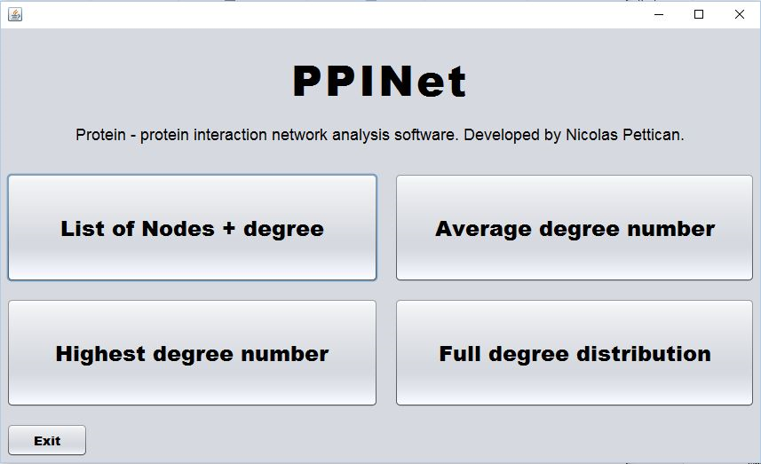

# PPINet

An amateur's take to create a java program.

This program was designed for Systems Biology, working with protein-protein interactions (PPIs) as nodes and degrees. It inputs a PPI text file, constructs a network and can output the degree to any given node, the average degree of all nodes, the hubs of the network (nodes of highest degree), and the full degree distribution.

I compiled the program and it runs as a .jar executable file with a nice simple GUI (as shown the image bellow).

<figure>
  
</figure>

However, due to time constraints and my last minute decision to use NetBeans instead of Eclipse to construct the GUI (which admitedly I should have done before writing the actual code…) the code ended up being too long. Instead of 4 classes I had to make 7 because for some reason the code worked perfectly on Eclipse yet NetBeans did not allow me to call the methods from the GUI buttons. By that time it was too late to ask for help on Stack Overflow, so I had to separate them into separate classes changing only a couple of lines for each calculation as I found that this way it actually ran properly.

The other classes that output the different calculations differ from the Network class in only a couple of lines under the Network() object.

Feel free to leave an *issue* if you think of a reason why I was unable to call the methods from the GUI buttons (I’m sure if you’re experienced with Java you’ll spot it).
